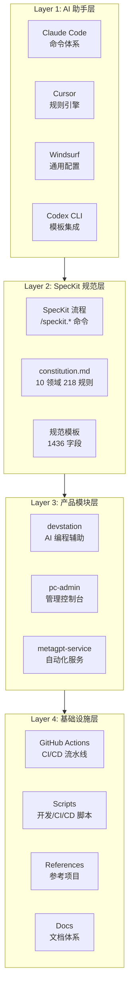
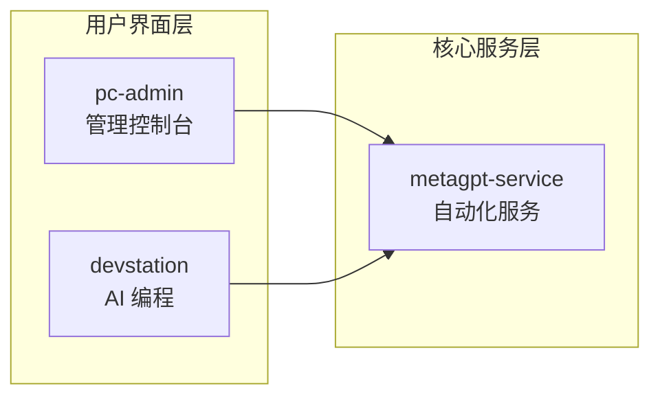

# Enterprise Workspace 企业工作空间架构文档

企业级工作区（Enterprise Workspace），采用 Monorepo 架构组织多个相关项目，是全链路协同编程系统，采用 SpecKit 规范驱动开发方法论。

**GitHub 仓库**：[BellisGit/enterprise-workspace](https://github.com/BellisGit/enterprise-workspace)

> **重要说明**：顶层根仓库作为**全局工程化整合基座**，存放跨模块的全局配置、脚本、CI/CD、文档；产品模块可采用 Git Submodule 或本地目录形式管理。

---

## 一、项目概述

### 1.1 企业工作空间定位

企业工作空间是一个**全链路协同编程系统**，核心能力包括多产品协同、规范驱动开发、多 AI 助手支持和企业级工程化四个维度。在多产品协同方面，AI 编程辅助、管理控制台、Agent 编排、运维平台等模块统一在工作区内开发与集成，实现资源共享和能力复用。规范驱动开发采用 GitHub SpecKit 方法论，将需求定义、规格说明、技术规划、任务分解、实施开发和测试验收六个阶段标准化，确保开发过程的可追溯性和一致性。多 AI 助手支持覆盖 Claude Code、Cursor、Windsurf、Codex CLI 等主流工具，通过统一配置自动加载项目规范，降低团队成员的学习成本。企业级工程化包括统一的分支策略、提交规范、CI/CD 流水线、质量门禁和部署策略，保障交付质量的稳定性。

### 1.2 SpecKit 规范驱动开发流程

```
需求定义 → 规格说明 → 技术规划 → 任务分解 → 实施开发 → 测试验收
```

| 阶段 | 命令 | 输出文件 | 位置 |
|------|------|----------|------|
| 需求定义 | `/speckit.specify` | spec.md | specs/FEATURE-*/ |
| 技术规划 | `/speckit.plan` | plan.md | specs/FEATURE-*/ |
| 任务分解 | `/speckit.tasks` | tasks.md | specs/FEATURE-*/ |
| 实施开发 | `/speckit.implement` | 代码 | products/*/ |
| 测试验收 | 手动验证 | 测试报告 | reports/ |

**核心命令**：`/speckit.constitution`、`/speckit.specify`、`/speckit.plan`、`/speckit.tasks`、`/speckit.implement`  
**辅助命令**：`/speckit.clarify`、`/speckit.analyze`、`/speckit.checklist`

### 1.3 规范模板体系

| 模板类型 | 文件路径 | 字段数量 | 主要章节 |
|----------|----------|----------|----------|
| 功能规格模板 | `.specify/templates/spec-template.md` | 402 字段 | 用户故事、功能需求、数据模型、接口设计、测试需求 |
| 技术计划模板 | `.specify/templates/plan-template.md` | 634 字段 | 架构设计、详细设计、安全设计、性能设计、部署设计 |
| 任务分解模板 | `.specify/templates/tasks-template.md` | 430 字段 | 阶段任务、任务依赖、执行记录、验收总结 |

### 1.4 SpecKit 自动化脚本

| 脚本 | 路径 | 功能 |
|------|------|------|
| speckit-validator.ts | `.specify/scripts/speckit-validator.ts` | feature_id 格式验证、循环依赖检测、完整度评分 |
| speckit-converter.ts | `.specify/scripts/speckit-converter.ts` | RawSpecInput 转换、关键词提取、ID 自动生成 |
| ai-quality-gate.ts | `.specify/scripts/ai-quality-gate.ts` | 代码质量门禁、类型检查、安全扫描、覆盖率检查 |
| common.sh | `.specify/scripts/common.sh` | 环境检查、Git 操作、ID 生成、constitution 验证 |

---

## 二、架构层次概览

企业工作空间采用四层架构设计，每层承担不同职责，层与层之间通过标准化接口通信：



| 层次 | 核心职责 | 关键组件 |
|------|----------|----------|
| **AI 助手层** | 多工具配置自动加载 | CLAUDE.md、AGENTS.md、.cursor/rules/ |
| **SpecKit 规范层** | 规范定义与流程驱动 | constitution.md、templates/、scripts/ |
| **产品模块层** | 业务功能实现 | 3 大核心产品 |
| **基础设施层** | 工程化支撑 | CI/CD、脚本、参考、文档 |

---

## 三、产品模块详解

### 3.1 产品模块总览

| 产品模块 | 技术栈 | 状态 | 核心职责 | 规模 |
|----------|--------|------|----------|------|
| **devstation** | React 18 + Go 1.21 | 已实现 | AI 编程辅助聊天界面，多模型集成与使用量追踪 | 中型 |
| **pc-admin** | Vue 3 + TypeScript | 已实现 | 管理控制台，微前端架构，30+ 业务应用 | **大型**（6000+ 文件） |
| **metagpt-service** | Python 3.11 + FastAPI | 已实现 | MetaGPT 自动化代码生成服务，多角色协同 | 中型 |

> **说明**：原计划中的 agent-orchestrator、agent-cli-web、ops-platform 已暂停开发。

### 3.2 devstation（AI 编程辅助）

**产品路径**：`products/devstation/`  
**产品定位**：提供 AI 编程辅助聊天界面，支持多种模型（如 Qwen3、Llama3）的集成与切换，实现完整的使用量追踪与限制管理功能。  
**后端技术栈**：Go 1.21、Echo 框架、Viper 配置管理、GORM + SQLite 数据持久化、Testify 测试工具。  
**前端技术栈**：React 18 + TypeScript，提供现代化聊天界面和代码编辑体验。

**核心目录结构**：

| 目录/文件 | 用途 |
|-----------|------|
| `cmd/chat-verify/` | 聊天验证模块入口 |
| `cmd/server/` | 主服务器入口 |
| `config/` | 配置文件和测试代码 |
| `db/sqlite/` | SQLite 数据库实现和测试 |
| `internal/chat/` | 聊天模块，包含模板 |
| `internal/completion/` | 代码补全功能 |
| `internal/config/` | 配置管理模块 |
| `internal/context/` | 上下文管理 |
| `internal/integration/` | 外部集成模块 |
| `internal/letta/` | Letta AI 客户端 |
| `internal/model/` | 模型工厂和管理 |
| `internal/ollama/` | Ollama 本地模型集成 |
| `internal/server/` | 服务器实现 |
| `internal/usage/` | 使用量追踪和限制管理 |
| `ui/` | React 前端界面 |
| `extensions/vscode/` | VS Code 扩展 |

**VS Code 扩展功能**：

| 功能模块 | 描述 |
|----------|------|
| commands/ | 命令注册，提供 10+ 核心命令 |
| sidebar/ | 侧边栏视图，与主应用通信 |
| security/ | 安全扫描功能 |
| file-tree/ | 文件资源管理器集成 |

**配置与环境**：

| 配置项 | 说明 |
|--------|------|
| `config.yaml` | 主配置文件 |
| `AI_CONFIG.md` | AI 模型配置文档 |
| `go.mod` | Go 依赖管理 |
| `ui/package.json` | 前端依赖管理 |

**集成能力**：通过 Go 客户端可扩展任务分发和调度功能。

### 3.3 pc-admin（管理控制台）

**产品路径**：`products/pc-admin/`  
**产品定位**：基于微前端架构的企业级管理控制台，是产品目录中规模最大的模块，包含超过 6000 个文件，实际定位为 **BTC ShopFlow Monorepo** 供应链管理系统。  
**技术架构**：

| 层级 | 技术选型 | 说明 |
|------|----------|------|
| 前端框架 | Vue 3 + TypeScript | 组件化开发 |
| UI 组件库 | Ant Design Pro | 企业级 UI 组件 |
| 构建工具 | Vite | 快速构建与热更新 |
| 状态管理 | Pinia | 轻量级状态管理 |
| 样式方案 | UnoCSS | 原子化 CSS |
| 多应用架构 | qiankun | 微前端框架 |
| 包管理 | pnpm | Monorepo 包管理 |

**核心模块结构**：

| 模块路径 | 主要内容 |
|----------|----------|
| `apps/` | 30+ 业务应用 |
| `apps/system-app/` | 系统应用，包含微前端容器 |
| `apps/admin-app/` | 管理应用 |
| `apps/logistics-app/` | 物流应用 |
| `apps/production-app/` | 生产应用 |
| `apps/quality-app/` | 品质应用 |
| `apps/engineering-app/` | 工程应用 |
| `apps/finance-app/` | 财务应用 |
| `apps/mobile-app/` | 移动应用 |
| `apps/docs-app/` | 文档站点 |
| `packages/` | 共享包 |
| `@btc/shared-components/` | 通用组件库 |
| `@btc/shared-core/` | 核心功能库 |
| `@btc/shared-utils/` | 工具函数库 |
| `@btc/vite-plugin/` | 自定义 Vite 插件 |
| `@btc/subapp-manifests/` | 子应用清单配置 |
| `auth/` | 认证模块 |
| `locales/` | 国际化支持 |
| `configs/` | Vite、ESLint、TypeScript 构建配置 |

**开发规范**：

| 规范项 | 说明 |
|--------|------|
| Design Token | 全局设计令牌管理样式 |
| Bootstrap 启动 | 统一的应用启动与加载机制 |
| qiankun 微前端 | 基于 qiankun 的微前端实现 |
| 懒加载 | 按业务线分组，支持懒加载与预加载 |

### 3.4 metagpt-service（自动化服务）

**产品路径**：`products/metagpt-service/`  
**产品定位**：基于 FastAPI 的高性能服务，封装 MetaGPT 核心能力，提供智能代码生成、规格生成和工作流管理功能，与 SpecKit 规范驱动开发系统深度集成。  
**核心特性**：

| 特性 | 描述 |
|------|------|
| 多角色协同 | 产品经理、架构师、工程师、QA 工程师并行工作 |
| 多技术栈支持 | TypeScript、Go、Python 等多种语言代码生成 |
| 质量门禁 | 自动类型检查、代码风格检查、安全检查 |
| 规范执行 | 自动应用项目编码规范 |
| 异步任务 | 长时间运行任务支持异步处理 |
| 可观测性 | 日志、指标、追踪支持 |

**技术栈**：

| 类别 | 技术选型 |
|------|----------|
| 核心框架 | FastAPI + Python 3.11 |
| 数据验证 | Pydantic |
| 异步 HTTP | httpx |
| 配置管理 | python-dotenv |
| 日志记录 | loguru |
| 测试框架 | pytest |
| 类型检查 | mypy |

**项目结构**：

| 目录/文件 | 用途 |
|-----------|------|
| `app/main.py` | FastAPI 应用入口 |
| `app/config.py` | 配置管理 |
| `app/api/routes/` | API 路由 |
| `app/api/routes/code_gen.py` | 代码生成接口 |
| `app/api/routes/spec_gen.py` | 规格生成接口 |
| `app/api/routes/workflow.py` | 工作流接口 |
| `app/api/routes/health.py` | 健康检查 |
| `app/api/middleware/` | 中间件 |
| `app/api/middleware/logging.py` | 日志中间件 |
| `app/services/metagpt/` | MetaGPT 引擎封装 |
| `app/models/schemas.py` | Pydantic 模型定义 |
| `app/utils/logger.py` | 日志工具 |
| `deploy/` | Helm Chart 和 K8s 配置 |
| `tests/` | API 测试用例 |

**API 接口**：

| 接口路径 | 方法 | 描述 |
|----------|------|------|
| `/api/docs` | GET | Swagger UI |
| `/api/redoc` | GET | ReDoc |
| `/api/openapi.json` | GET | OpenAPI JSON |
| `/api/v1/health` | GET | 健康检查 |
| `/api/v1/generate` | POST | 同步代码生成 |
| `/api/v1/generate/async` | POST | 异步代码生成（返回任务 ID） |
| `/api/v1/spec` | POST | 规格生成 |
| `/api/v1/workflow` | POST | 工作流管理 |

### 3.5 产品间依赖关系



**调用关系说明**：

| 调用方向 | 说明 |
|----------|------|
| devstation → metagpt-service | AI 编程辅助直接调用代码生成服务 |
| pc-admin → metagpt-service | 管理控制台集成代码生成能力 |

---

## 四、AI 助手配置体系

### 4.1 五层配置优先级

企业工作空间采用**多层次配置架构**，确保不同 AI 助手能够根据自身特性加载最适合的配置方案：

| 优先级 | 配置文件 | 格式 | 行数 | 特点 |
|--------|----------|------|------|------|
| 第 1 层 | `CLAUDE.md` | Markdown | 609 行 | 项目主配置，所有 AI 助手基准 |
| 第 2 层 | `AGENTS.md` | Markdown | 590 行 | 多 AI 助手详细配置 |
| 第 3 层 | `constitution.md` | Markdown | 218 条规则 | 项目治理原则 |
| 第 4 层 | `.cursor/rules/*.jsonc` | JSONC | 108+ 行 | Cursor 专用规则引擎 |
| 第 5 层 | `.specify/templates/` | Markdown | 1436 字段 | 规范模板 |

### 4.2 各 AI 助手配置差异

| AI 助手 | 主配置 | 辅助配置 | 命令体系 | RAG 集成 | 特点 |
|---------|--------|----------|----------|----------|------|
| **Claude Code** | CLAUDE.md | constitution.md | `/speckit.*` 命令 | 完整支持 | 最深度集成，独享命令体系 |
| **Cursor** | `.cursor/rules/*.jsonc` | CLAUDE.md + constitution.md | 规则引擎 | 有限支持 | 文件匹配、优先级、条件触发 |
| **Windsurf** | CLAUDE.md | constitution.md | 自然语言 | 完整支持 | 与 Claude Code 相同机制 |
| **Codex CLI** | CLAUDE.md | constitution.md + templates | 脚本调用 | 有限支持 | 模板集成、自动化脚本 |

**Cursor 规则引擎特性**：

| 特性 | 说明 |
|------|------|
| `match.filePatterns` | 针对不同文件类型（.ts、.tsx、.go、.py）应用不同规则 |
| `priority` | 优先级设置（highest、high、medium），高优先级规则优先应用 |
| `when` | 条件触发控制规则应用时机 |
| `autoLoad: true` | 启动时自动加载规范 |

**Cursor 规则文件**：

| 文件 | 功能 |
|------|------|
| `spec-driven-development.jsonc` | 规范驱动开发核心规则（5 条） |
| `ai-coding-best-practices.jsonc` | AI 编程最佳实践（集成 Boris Cherny 十大技巧） |
| `multi-command.jsonc` | 多命令支持 |

### 4.3 constitution.md 十大原则领域

`.specify/memory/constitution.md` 定义了项目治理的十大核心原则，共包含 218 条具体规则：

| 领域 | 规则数量 | 主要内容 |
|------|----------|----------|
| 代码质量标准 | 15+ | TypeScript 严格模式、Go lint、错误处理、DRY 原则 |
| 测试要求 | 10+ | 覆盖率 ≥80%、单元/集成/E2E 测试、工厂模式 |
| 安全性要求 | 20+ | OAuth 2.0/OIDC、敏感数据加密、最小权限、审计日志 |
| 性能要求 | 12+ | LCP≤2.5s、CLS≤0.1、API P95≤500ms |
| 架构原则 | 15+ | 领域驱动设计、RESTful/GraphQL、熔断降级 |
| 开发流程 | 15+ | Git Flow、Conventional Commits、PR 审查 |
| 文档规范 | 10+ | OpenAPI 规范、README 要求、CHANGELOG |
| 协作规范 | 8+ | 决策公开、定期分享、会议规范 |
| 规范治理 | 5+ | RFC 提案、版本化管理、linter 自动检查 |
| 决策指南 | 10+ | 优先级：安全>性能、标准化>定制化 |

**代码质量核心规则**：

| 规则 | 说明 |
|------|------|
| TypeScript 严格模式 | `strict: true`、`noImplicitAny: true`、`strictNullChecks: true` |
| 禁止 any 类型 | 除非有特殊注释说明，否则不允许使用 |
| Go 错误处理 | 禁止裸用 `panic`，必须返回错误 |
| 函数长度 | 不超过 50 行 |
| 注释要求 | 复杂逻辑必须添加注释 |

**安全性核心规则**：

| 规则 | 说明 |
|------|------|
| 认证授权 | OAuth 2.0/OIDC，多因素认证，Token 定期刷新 |
| 数据安全 | 敏感数据加密存储，传输使用 HTTPS/TLS 1.3 |
| 输入验证 | 所有用户输入必须验证和清理，防止 SQL 注入/XSS |
| 审计日志 | 关键操作记录，日志保留至少 180 天 |

**性能核心规则**：

| 指标 | 要求 |
|------|------|
| LCP | ≤2.5 秒 |
| CLS | ≤0.1 |
| FID | ≤100 毫秒 |
| 首屏资源 | ≤500KB（压缩后） |
| API P95 | ≤500ms |
| 并发支持 | ≥1000 QPS |

### 4.4 优先级决策指南

当面临技术决策时，按以下优先级考虑：

1. **安全性 > 一切**
2. **可维护性 > 性能优化**
3. **标准化 > 定制化**
4. **简单 > 复杂**
5. **可观测 > 黑盒**

### 4.5 SpecKit 核心命令详解

**核心命令**：

| 命令 | 描述 | 输出 |
|------|------|------|
| `/speckit.constitution` | 创建或更新项目治理原则 | 更新 constitution.md |
| `/speckit.specify` | 定义功能需求（what & why） | spec.md |
| `/speckit.plan` | 创建技术实施方案（how） | plan.md |
| `/speckit.tasks` | 生成可执行任务列表 | tasks.md |
| `/speckit.implement` | 执行所有开发任务 | 代码 |

**辅助命令**：

| 命令 | 描述 |
|------|------|
| `/speckit.clarify` | 澄清规格中的模糊之处 |
| `/speckit.analyze` | 跨工件一致性分析 |
| `/speckit.checklist` | 生成质量检查清单 |

---

### 3.7 基础设施详解

Enterprise Workspace 的基础设施模块提供完整的开发、部署、运维支撑能力，包括 CLI 工具、安全扫描、多 Agent 协作、知识管理和文档系统等核心组件。

#### 3.7.1 CLI 工具

**文档**：[cmd/cli/README.md](../cmd/cli/README.md)

CLI 工具是 DevStation 的核心命令行入口，提供项目管理、模型管理、会话管理、对话编程、代码补全、安全扫描、容器实例管理、测试生成、部署管理等全面的开发能力。

| 功能模块 | 命令示例 | 说明 |
|----------|----------|------|
| 项目管理 | `devstation project list/create/delete` | 项目生命周期管理 |
| 模型管理 | `devstation model list/pull/use` | AI 模型安装和切换 |
| 对话编程 | `devstation chat start/context` | 上下文感知的 AI 编程 |
| 安全扫描 | `devstation scan file/dir` | SAST 和 Secret 检测 |
| 部署管理 | `devstation deploy --product=xxx --env=prod` | 多策略部署 |
| 容器实例 | `devstation instance create/exec` | 隔离开发环境 |

#### 3.7.2 CLI 网关

**文档**：[cmd/cli-gateway/README.md](../cmd/cli-gateway/README.md)

CLI 网关将 CLI 功能以 HTTP API 形式暴露，支持与外部系统（如 Moltbot）的集成。

| 功能 | 说明 |
|------|------|
| RESTful API | 将 CLI 命令转换为 HTTP 端点 |
| CORS 支持 | 跨域资源共享配置 |
| Moltbot 集成 | 与机器人平台无缝对接 |

#### 3.7.3 安全扫描模块

**文档**：[internal/security/README.md](../internal/security/README.md)

安全扫描模块提供 SAST 和 Secret 检测能力，支持多种编程语言和输出格式。

| 功能类别 | 检测类型 |
|----------|----------|
| SAST 扫描 | SQL 注入、XSS、命令注入、路径遍历等 |
| Secret 检测 | AWS Key、GitHub Token、API Key、JWT 等 |
| 报告格式 | JSON、SARIF、HTML、Markdown、Console |

#### 3.7.4 Sisyphus 多 Agent 系统

**文档**：[.sisyphus/README.md](../.sisyphus/README.md)

Sisyphus 是 10 Agent 并行执行系统，专为大规模架构升级任务设计。

| Agent | 名称 | 主要产出 |
|-------|------|----------|
| 1 | 规划协调 | 风险评估、团队分工 |
| 2 | 目录与配置 | 目录结构、全局配置 |
| 3-8 | 代码开发 | 组件、Hooks、工具、业务层 |
| 9 | 后端共享层 | infra、backend-common |
| 10 | 文档与部署 | CI/CD、监控、培训 |

#### 3.7.5 MCP 服务器

**文档**：[mcp-servers/README.md](../mcp-servers/README.md)

MCP 服务器为 Cursor IDE 提供多 Agent 并行执行能力，支持 `/multi` 斜杠命令。

| 功能 | 说明 |
|------|------|
| 并行执行 | 最多 8 个子 Agent 同时工作 |
| 智能分解 | 自动检测任务复杂度 |
| 策略支持 | auto、sequential、parallel、hierarchical |

#### 3.7.6 RAG 知识库

**文档**：[knowledge-base/RAG/README.md](../knowledge-base/RAG/README.md)

语义驱动的知识检索系统，支持自然语言查询和代码定位。

| 查询模式 | 示例 |
|----------|------|
| LOCATE | "Menu 组件在哪里" |
| LIST | "所有导航组件" |
| UNDERSTAND | "Menu 如何实现折叠" |

#### 3.7.7 原子文档系统

**文档**：[atomic-docs-system/README.md](../atomic-docs-system/README.md)

配置驱动的文档资产管理，支持多产品文档自动生成。

| 特性 | 说明 |
|------|------|
| 配置驱动 | products.json、plugins.json |
| 插件化 | Vue、React、Go 文档生成器 |
| CI/CD 集成 | 自动扫描、生成、部署 |

#### 3.7.8 基础设施索引

**文档**：[infra/README.md](../infra/README.md)

基础设施完整索引，包含所有模块的详细说明和使用指南。

---

## 五、CI/CD 与开发流程

### 5.1 GitHub Actions 工作流概览

| 工作流文件 | 触发条件 | 主要功能 |
|------------|----------|----------|
| `ci.yml` | push/PR 到 main、develop | lint、文档、安全、构建验证 |
| `cd.yml` | release published | NPM 发布、基础设施部署 |
| `release-please.yml` | push 到 main/master 或手动触发 | 自动版本升级、CHANGELOG 生成 |
| `pr-validation.yml` | PR 创建/更新 | PR 标题、分支命名、冲突检测 |
| `feature-branch.yml` | push 到非 main/develop 分支 | 功能分支验证、完成度检查 |
| `hotfix.yml` | push/PR 到 main | 紧急修复验证、版本检查 |
| `p0-deploy.yml` | push cmd/cli 相关 | P0 CLI 构建与集成测试 |
| `metagpt-service.yml` | push/PR 到 main、develop（路径过滤） | MetaGPT 服务完整 CI/CD |

### 5.2 CI 工作流详细分析

**ci.yml** 包含五个并行检查阶段：

| 阶段 | 任务 | 说明 |
|------|------|------|
| lint | 文件结构检查 | 检查 Monorepo 结构信息 |
| validate-structure | 目录结构验证 | products、services、tools、docs、infrastructure、config |
| documentation | 文档检查 | docs/ 和 .github/ 目录结构 |
| security-check | 安全检查 | .gitignore 配置验证 |
| build-test | 构建测试 | 项目统计和构建验证 |

**notify 汇总**：所有检查通过后输出完成状态。

### 5.3 CD 工作流详细分析

**cd.yml** 部署流程：

| 阶段 | 任务 | 条件 | 说明 |
|------|------|------|------|
| publish-npm | NPM 发布 | tag 以 'v' 开头 | pnpm build + npm publish |
| deploy-infrastructure | 基础设施部署 | 非预发布版本 | Helm/K8s 部署 + 健康检查 |

### 5.4 PR Validation 工作流详细分析

| 检查项 | 规则 | 验证内容 |
|--------|------|----------|
| PR 标题检查 | Conventional Commits | `<type>(<scope>): <description>` |
| PR 大小检查 | 文件变更统计 | 评估审查规模 |
| 分支命名检查 | Git Flow 规范 | feature/*、bugfix/*、hotfix/* |
| 冲突检查 | 合并冲突检测 | 提示解决冲突 |
| 文档检查 | WORKSPACE.md、BRANCH_STRATEGY.md | 文档完整性 |

**支持的分支类型**：main、develop、feature/*、bugfix/*、hotfix/*、release/*  
**支持的提交类型**：feat、fix、docs、style、refactor、perf、test、chore、hotfix、release

### 5.5 关键脚本说明（15+ 个脚本）

**开发环境脚本**（`scripts/dev/`）：

| 脚本 | 功能 | 核心特性 |
|------|------|----------|
| `init-env.sh` | 环境初始化 | Node.js 版本检查、依赖安装、.env 配置 |
| `start-all.sh` | 一键启动所有服务 | 端口检测、进程管理、优雅终止 |
| `start-frontend.sh` | 启动前端服务（默认 8080） | 跨平台兼容（Windows/Linux/macOS）、自动端口清理 |
| `start-backend.sh` | 启动后端服务 | 支持 Node.js/Python/Java、自动端口检测 |
| `stop-ui.sh` | 停止 UI 服务 | 快速终止 8080 端口进程 |
| `check-deps.sh` | 依赖检查 | 三级检查（必需/可选/项目依赖）、环境变量验证 |

**CI 脚本**（`scripts/ci/`）：

| 脚本 | 功能 | 检查项目 |
|------|------|----------|
| `pre-validate.sh` | CI 前置校验 | ESLint、TypeScript 测试、敏感信息、文件完整性 |
| `cache-deps.sh` | 依赖缓存管理 | save/restore/clean/status 模式、跨平台缓存键生成 |
| `artifact-check.sh` | 构建产物校验 | 文件存在性、数量统计、大小检查、空文件检测 |

**CD 脚本**（`scripts/cd/`）：

| 脚本 | 功能 | 流程步骤 |
|------|------|----------|
| `deploy-prod.sh` | 生产部署 | 10 步流程：SSH 检查 → 构建准备 → 测试 → 前端构建 → 后端构建 → 创建部署包 → 备份 → 上传 → 解压 → 重启 → 健康检查 |
| `deploy-test.sh` | 测试部署 | 8 步流程：简化版生产部署 |
| `hot-update-prod.sh` | 生产热更新 | file/patch/bundle 三种模式、备份 → 更新 → 验证 |
| `rollback.sh` | 回滚 | 指定版本或上一备份、手动确认、健康检查 |

**发布脚本**（`scripts/release/`）：

| 脚本 | 功能 |
|------|------|
| `create-tag.sh` | 语义化版本标签创建，支持 GitHub Release |
| `generate-changelog.sh` | 自动 CHANGELOG 生成，12 种变更类型分类 |

**批量操作脚本**（`scripts/`）：

| 脚本 | 功能 |
|------|------|
| `build-all.sh` | enterprise-workspace 批量构建，design-system 优先 |
| `lint-all.sh` | 批量代码检查，支持 `--fix` 自动修复 |
| `test-all.sh` | 批量测试执行，支持 `--coverage` 覆盖率报告 |
| `clean-all.sh` | 批量清理，支持 `--all` 深度清理 |

### 5.6 部署环境与策略

| 环境 | 触发条件 | 审批要求 | 部署方式 | 特点 |
|------|----------|----------|----------|------|
| **开发** | 任意提交 | 无 | 自动 | 频繁部署，轻量配置 |
| **Staging** | PR 合并 develop | 无 | 自动 | 配置接近生产 |
| **生产** | 合并 main | GitHub 审批 | 手动触发 | 严格审批，回滚准备 |
| **热更新** | 紧急修复 | 二次确认 | 快速部署 | 最小停机时间 |

### 5.7 分支策略与流水线

```
feature/* ──PR──► develop ──PR──► main ──► 生产环境
                │                   │
                │                   ▼
                │              hotfix/*
                ▼
             bugfix/*
```

| 分支类型 | 来源 | 合并目标 | 保护级别 |
|----------|------|----------|----------|
| main | - | - | 受保护，禁止直接推送 |
| develop | main | main | 受保护，禁止直接推送 |
| feature/* | develop | develop | 可推送 |
| bugfix/* | develop | develop | 可推送 |
| hotfix/* | main | main + develop | 可推送 |
| release/* | develop | main | 发布准备分支 |

---

## 六、文档与参考资源

### 6.1 文档分类体系

```
docs/
├── architecture/                    # 架构设计文档
│   ├── git-repository-architecture.txt
│   └── project-structure.txt
├── development/                     # 开发规范文档
│   ├── system-development-guidelines.md
│   ├── coding-standards-quick-ref.md
│   ├── 规范徽章.md
│   └── 规范速查卡.md
├── devstation-docs/                 # DevStation AI 集成文档
│   └── 02-ai-integration/          # AI 集成核心文档（29 个模块）
├── design-system/                   # 设计系统文档
│   ├── DESIGN_SYSTEM_GUIDE.md
│   ├── frontend-design-language-reference.md
│   └── theme-system-alignment-report.md
├── cicd/                            # CI/CD 文档
├── middleware/                      # 中间件文档
├── ops-platform-docs/               # 运维平台文档
│   ├── 02-core-modules/
│   ├── 03-enterprise-features/
│   ├── 04-frontend/
│   └── 05-infrastructure/
├── pc-components/                   # PC 端组件文档
├── mobile-components/               # 移动端组件文档
├── standards/                       # 标准规范文档
└── 设计方案/                        # 设计方案文档
```

### 6.2 核心文档清单（按优先级）

**第一优先级（项目根基）**：

| 文档路径 | 文档名称 | 说明 |
|----------|----------|------|
| `CLAUDE.md` | 项目主配置 | 所有 AI 助手自动加载的规范基准 |
| `docs/development/system-development-guidelines.md` | 系统级开发规范 | Git 分支、提交规范、代码质量、版本管理 |
| `docs/architecture/git-repository-architecture.txt` | Git 仓库架构 | Submodule 管理模式、顶层根仓库与子仓库关系 |
| `docs/architecture/project-structure.txt` | 项目结构设计 | 完整工作区目录结构模板 |

**第二优先级（编码规范）**：

| 文档路径 | 文档名称 | 说明 |
|----------|----------|------|
| `docs/development/coding-standards-quick-ref.md` | 编码规范速查表 | TypeScript/Go 规范、错误处理、测试规范 |
| `AGENTS.md` | 多 AI 助手配置 | 各工具的配置差异和自动加载机制 |
| `.cursor/rules/spec-driven-development.jsonc` | SpecKit 规则 | Cursor 专用规则引擎配置 |

**第三优先级（AI 集成）**：

| 文档路径 | 文档名称 | 说明 |
|----------|----------|------|
| `docs/devstation-docs/02-ai-integration/04-ai-coding-best-practices.md` | AI 编程最佳实践 | Boris Cherny 十大技巧集成 |
| `docs/devstation-docs/02-ai-integration/05-planning-template.md` | 复杂任务规划模板 | 需求描述、技术方案、风险评估 |
| `docs/devstation-docs/02-ai-integration/06-subagent-guide.md` | Subagent 使用指南 | 适用场景、调用流程、权限控制 |
| `docs/devstation-docs/02-ai-integration/16-subagent-workflow.md` | Subagent 调用标准流程 | 准备、执行、评审各阶段 |

**第四优先级（专项指南）**：

| 文档路径 | 文档名称 | 说明 |
|----------|----------|------|
| `docs/design-system/DESIGN_SYSTEM_GUIDE.md` | 设计系统指南 | 原子化设计、Design Token、主题系统 |
| `.claude/settings.local.json` | Claude 本地配置 | 允许执行的命令权限配置 |
| `docs/ops-platform-docs/` | 运维平台文档 | 基础设施管理、监控告警 |

### 6.3 参考项目说明

| 目录/项目 | 类型 | 技术栈 | 主要用途 | 文件数量 |
|------------|------|--------|----------|----------|
| `references/oh-my-opencode-dev/` | 本地参考 | TypeScript | AI 编程辅助与编排参考 | 555 |
| `references/ralph-claude-code/` | Submodule | Shell + Claude | Claude Code 集成参考 | 200+ |
| `references/ant-design-pro-master/` | 参考 | React | 中后台前端架构参考 | 1073 |
| `references/art-design-pro-main/` | 参考 | Vue 3 | Vue 3 设计系统参考 | 600+ |
| `references/cool-admin-vue-8.x/` | 参考 | Vue 3 + Node.js | 后台快速开发与 CRUD | 598 |
| `references/ant-design-mobile-master/` | 参考 | React Mobile | 移动端 UI 设计参考 | 1000+ |

**cool-admin 模块开发约定**：

| 目录/文件 | 用途 | 约定 |
|-----------|------|------|
| `pages/` | 页面路由 | 需在 config.ts 中配置注册 |
| `views/` | 视图路由 | 需在 config.ts 中配置注册 |
| `hooks/` | 组合式函数 | 导出 use+模块名格式 |
| `components/` | 组件 | 需在 config.ts 中注册 |
| `directives/` | 自定义指令 | 自动注册为 v-文件名 |
| `store/` | Pinia 状态 | 遵循 Pinia 规范 |
| `config.ts` | 模块配置 | 包含 enable、label、order |
| `index.ts` | 入口导出 | 开放变量和方法供外部使用 |

### 6.4 Claude 配置分析

**`.claude/settings.local.json`** 权限配置：

| 权限类别 | 允许的命令 | 说明 |
|----------|------------|------|
| 包管理 | `pnpm run dev`、`pnpm install`、`pnpm --version` | 依赖安装和开发启动 |
| 系统命令 | `cmd /c:*` | Windows 命令执行 |
| 网络诊断 | `netstat:*`、`findstr:*` | 端口和进程排查 |
| 进程管理 | `tasklist:*` | 进程查看 |
| HTTP 请求 | `curl:*` | API 测试 |
| Node 环境 | `node:*`、`npx:*` | Node.js 命令执行 |

**配置特点**：采用白名单机制，仅列出的命令可执行；针对 Windows 环境专门配置（netstat、findstr）；保留完整开发和调试能力。

---

## 七、附录

### 7.1 目录结构总览

```
enterprise-workspace/
├── CLAUDE.md                          # 项目主配置（AI 自动加载）
├── AGENTS.md                          # 多 AI 助手配置
├── WORKSPACE.md                       # 本架构文档
├── products/                          # 核心产品
│   ├── devstation/                    # AI 编程辅助
│   ├── pc-admin/                     # 管理控制台（BTC ShopFlow）
│   └── metagpt-service/              # 自动化服务
├── docs/                             # 文档体系
├── references/                       # 参考项目（已配置 .gitignore）
│   ├── oh-my-opencode-dev/
│   ├── ralph-claude-code/            # Claude Code 集成参考
│   ├── ant-design-pro-master/
│   ├── art-design-pro-main/
│   ├── cool-admin-vue-8.x/
│   ├── mobile-apps/
│   └── MonkeyCode-main/
├── scripts/                           # 全局脚本
│   ├── dev/                           # 开发脚本
│   ├── ci/                            # CI 脚本
│   ├── cd/                            # CD 脚本
│   ├── release/                       # 发布脚本
│   └── submodule/                      # Submodule 脚本
├── .github/workflows/                  # GitHub Actions
├── .specify/                          # SpecKit 模板与脚本
│   ├── memory/
│   │   └── constitution.md
│   ├── templates/
│   │   ├── spec-template.md
│   │   ├── plan-template.md
│   │   └── tasks-template.md
│   └── scripts/
├── .cursor/rules/                      # Cursor 规则
├── .claude/                           # Claude 配置
├── .gitmodules                        # Submodule 配置
├── backup/                            # 备份目录
│   └── pre-submodule-20260201-165512/
└── package.json                       # 根目录配置
```

### 7.2 快速开始

**环境要求**：

| 工具 | 版本要求 | 说明 |
|------|----------|------|
| Node.js | >= 18.0.0 | 前端运行时 |
| pnpm | >= 8.0.0 | 包管理器 |
| Git | - | 版本控制 |
| Go | >= 1.21 | 后端运行时（devstation） |
| Python | >= 3.11 | AI 服务运行时（metagpt-service） |

**快速启动命令**：

```bash
# 安装依赖
pnpm install

# 开发 pc-admin
cd products/pc-admin && pnpm dev

# 一键启动所有服务
./scripts/dev/start-all.sh

# 运行测试
./scripts/test-all.sh --coverage

# 构建生产版本
cd products/pc-admin && pnpm build
```

### 7.3 系统级规范速查

| 规范类别 | 具体要求 |
|-----------|----------|
| **分支策略** | main（生产）、develop（开发）、feature/*、bugfix/*、hotfix/* |
| **提交规范** | Conventional Commits，`<type>(<scope>): <subject>` |
| **代码质量** | TypeScript 严格模式、禁止 any、Go lint |
| **测试覆盖** | 核心业务逻辑 ≥80% |
| **安全性** | OAuth 2.0/OIDC、HTTPS/TLS 1.3、审计日志 ≥180 天 |
| **性能** | LCP≤2.5s、CLS≤0.1、API P95≤500ms |

### 7.4 相关文档链接

| 链接 | 说明 |
|------|------|
| [CLAUDE.md](CLAUDE.md) | 项目主配置 |
| [AGENTS.md](AGENTS.md) | 多 AI 助手配置 |
| [系统开发规范](docs/development/system-development-guidelines.md) | 完整开发规范 |
| [分支策略](.github/BRANCH_STRATEGY.md) | Git 分支管理 |
| [GitHub Workflows](.github/workflows/) | CI/CD 流水线 |
| [设计系统指南](docs/design-system/DESIGN_SYSTEM_GUIDE.md) | 前端组件规范 |
| [AI 编程最佳实践](docs/devstation-docs/02-ai-integration/04-ai-coding-best-practices.md) | AI 辅助开发指南 |
|

**基础设施文档**：

| [链接](链接) | [说明](说明) |
|------|------|
| [infra/README.md](infra/README.md) | 基础设施完整索引 |
| [cmd/cli/README.md](cmd/cli/README.md) | CLI 工具使用指南 |
| [cmd/cli-gateway/README.md](cmd/cli-gateway/README.md) | CLI 网关配置 |
| [internal/security/README.md](internal/security/README.md) | 安全扫描模块 |
| [.sisyphus/README.md](.sisyphus/README.md) | Sisyphus 多 Agent 系统 |
| [mcp-servers/README.md](mcp-servers/README.md) | MCP 服务器文档 |
| [knowledge-base/RAG/README.md](knowledge-base/RAG/README.md) | RAG 知识库 |
| [atomic-docs-system/README.md](atomic-docs-system/README.md) | 原子文档系统 |

---

**规范等级**：强制执行（Mandatory）  
**适用范围**：Enterprise Workspace 所有项目  
**最后更新**：2026-02-06
