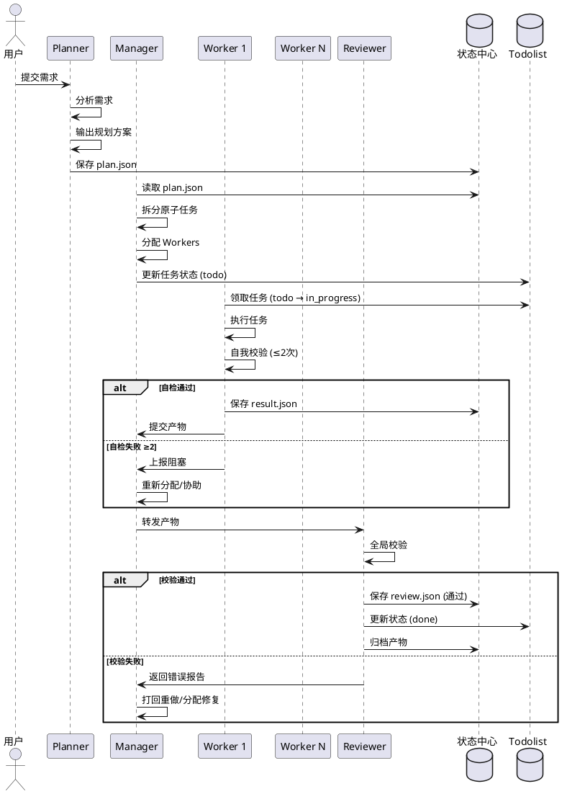

# 四角色协作自动化方案

> 版本：1.0
> 创建时间：2026-02-07
> 目标：实现完整的自动化多 Agent 协作工作流

---

## 一、完整工作流（PlantUML）

```plantuml
@startuml
skinparam defaultTextAlignment center
skinparam rectangle {
    BackgroundColor #e6f3ff
    BorderColor #66a3ff
    FontName 微软雅黑
}
skinparam arrow {
    Color #666666
    LineWidth 1.2
}

' 定义流程节点
rectangle "计划者：接收顶层任务" as A
rectangle "任务：构建支持多主题的Design Token系统" as B #fce4ec
rectangle "输出顶层规划方案\n1.技术选型/原子功能拆分\n2.全局规则（命名/兼容性）\n3.里程碑节点" as C
rectangle "管理者：接收规划方案" as D
rectangle "拆解为原子任务\n例：Token定义/主题切换函数/组件样式适配" as E
rectangle "分配任务给对应专业执行者\n如：Token执行者/函数执行者/样式执行者" as F
rectangle "执行者：接收原子任务" as G
rectangle "执行任务+实时自我校验\n校验规则：局部命名/语法/基础逻辑" as H
rectangle "自主纠正（最多2次）" as I
rectangle "输出无自我错误的原子产物" as J
rectangle "上报管理者→管理者重新分配/协助解决" as K
rectangle "管理者：接收产物" as L
rectangle "转发产物至审查者+附带任务信息" as M
rectangle "审查者：接收产物+全局校验规则" as N
rectangle "全局校验：跨应用兼容/样式冲突/性能/多主题适配" as O
rectangle "生成错误报告\n含：错误类型+影响范围+修复建议" as P
rectangle "输出最终原子产物→归档集成到主题系统" as Q
rectangle "沉淀优化：将本次错误/规则更新至全局规则库" as R
rectangle "分配修复任务给原执行者/专业子Agent" as S

' 主流程连线
A --> B
B --> C
C --> D
D --> E
E --> F
F --> G
G --> H

' 执行者校验分支
H -->|发现自我错误| I
H -->|无自我错误| J
I -->|纠正成功| J
I -->|纠正失败（≥2次）| K
K --> E : 下一轮任务

' 产物流转流程
J --> L
L --> M
M --> N
N --> O

' 审查者校验分支
O -->|发现全局错误| P
O -->|产物通过校验| Q
P --> L
Q --> R
R --> E : 下一轮任务

' 错误修复流程
L --> S
S --> E : 下一轮任务

@enduml
```

---

## 二、核心组件

### 2.1 共享状态中心
**位置**：`~/.claude/state/`

```
~/.claude/state/
├── projects/
│   └── {project-id}/
│       ├── project.yaml          # 项目配置
│       ├── milestones/           # 里程碑状态
│       │   └── {milestone}/
│       │       ├── plan.json    # Planner 输出（规划方案）
│       │       ├── tasks.json  # 任务列表（原子任务）
│       │       └── review.json  # 审查结果
│       └── workers/             # Worker 状态
│           └── {worker-id}/
│               ├── task.json    # 领取的任务
│               └── result.json  # 执行结果 + 自检记录
```

### 2.2 Worktree 管理
**位置**：`~/worktrees/`

```
~/worktrees/
├── {project-id}/
│   ├── planner/                 # Planner 工作区
│   ├── manager/                 # Manager 工作区
│   └── workers/
│       ├── worker-01/          # Worker 1：Token 定义
│       ├── worker-02/          # Worker 2：主题切换函数
│       └── worker-03/          # Worker 3：组件样式适配
```

### 2.3 Todolist 集成
**位置**：`docs/10-todolist/`

任务状态自动同步：
- `todo` → 等待 Manager 分配
- `in_progress` → Worker 执行中（自检中）
- `review` → 待 Reviewer 全局校验
- `done` → 校验通过，PR 已提交
- `blocked` → 自检失败 ≥2 次

---

## 三、四角色职责与自动化流程

### 3.1 Planner（计划者）→ 对应 PlantUML A→C

**职责**：
1. 接收用户需求（B）
2. 输出顶层规划方案（C）：
   - 技术选型
   - 原子功能拆分
   - 全局规则（命名规范、兼容性要求）
   - 里程碑节点

**输出**：`milestones/{milestone}/plan.json`

```yaml
plan:
  version: "1.0"
  project: "DesignToken系统"
  milestone: "v1.0"

  objectives:
    - id: OBJ-001
      title: "Token 核心定义"
      description: "定义 Design Token 数据结构和基础类型"
      metrics:
        - "Token 覆盖率 >= 100%"
        - "类型错误 = 0"
        - "文档完整性 100%"

    - id: OBJ-002
      title: "主题切换函数"
      description: "实现运行时主题切换能力"
      metrics:
        - "切换延迟 < 100ms"
        - "主题切换成功率 100%"
        - "内存泄漏 = 0"

    - id: OBJ-003
      title: "组件样式适配"
      description: "为所有公共组件适配 Design Token"
      metrics:
        - "组件适配率 100%"
        - "样式一致性 >= 95%"
        - "视觉回归 = 0"

  workers_needed: 3
  workflow:
    - phase: "Token 定义"
      workers: 1
      parallel: false
      objective: OBJ-001
    - phase: "主题切换函数"
      workers: 1
      parallel: false
      objective: OBJ-002
    - phase: "组件样式适配"
      workers: 1
      parallel: false
      objective: OBJ-003
```

---

### 3.2 Manager（管理者）→ 对应 PlantUML D→F

**职责**：
1. 接收规划方案（D）
2. 拆解为原子任务（E）
3. 分配给 Workers（F）
4. 处理异常（K、S）

**输出**：`milestones/{milestone}/tasks.json`

```yaml
tasks:
  project: "DesignToken系统"
  milestone: "v1.0"
  manager: "session-id"

  task_list:
    - id: TASK-001
      title: "Token 数据结构定义"
      worker: "worker-01"
      objective: OBJ-001
      priority: "P0"
      dependencies: []
      worktree: "~/worktrees/DesignToken/workers/worker-01"

    - id: TASK-002
      title: "主题切换 Hook 实现"
      worker: "worker-02"
      objective: OBJ-002
      priority: "P0"
      dependencies: ["TASK-001"]
      worktree: "~/worktrees/DesignToken/workers/worker-02"

    - id: TASK-003
      title: "Button 组件样式适配"
      worker: "worker-03"
      objective: OBJ-003
      priority: "P1"
      dependencies: ["TASK-001"]
      worktree: "~/worktrees/DesignToken/workers/worker-03"

  error_handling:
    self_check_failed: "重试（最多 2 次）"
    retry_exhausted: "上报 Manager"
    reviewer_failed: "重新分配 Worker"
```

---

### 3.3 Worker（执行者）→ 对应 PlantUML G→J

**职责**：
1. 接收原子任务（G）
2. 执行任务 + 实时自我校验（H）
3. 自主纠正（最多 2 次）（I）
4. 输出无自我错误的产物（J）

**自我校验规则**：
```yaml
self_check_rules:
  naming:
    - "变量命名符合项目规范"
    - "文件命名 kebab-case"
    - "类命名 PascalCase"

  syntax:
    - "TypeScript 编译无错误"
    - "ESLint 检查通过"

  logic:
    - "单元测试覆盖率 >= 80%"
    - "所有测试用例通过"

  output:
    - "产物完整性验证"
    - "产物正确性验证"
```

**Worker 执行流程**：
```
领取任务 → 执行 → 自检
                       ↓
              ┌───────┴───────┐
              ↓               ↓
         自检失败        自检通过
              ↓               ↓
         纠正（≤2次）     提交产物
              ↓               ↓
         ┌───────┴───────┐
         ↓               ↓
    纠正成功         纠正失败 ≥2
         ↓               ↓
      再次自检      上报 Manager
                         ↓
                  重新分配/协助
```

---

### 3.4 Manager → Reviewer 转发 → 对应 PlantUML L→M

**职责**：
1. 接收 Worker 产物（L）
2. 转发至 Reviewer（M）
3. 附带任务信息

**转发模板**：
```markdown
---
role: manager
action: forward_to_reviewer
project: DesignToken系统
milestone: v1.0
task_id: TASK-001
worker_id: worker-01
---

## 产物转发

**任务**：Token 数据结构定义
**Worker**：worker-01
**执行结果**：
- 自检通过（2 次内）
- 产物完整性：✅
- 单元测试覆盖率：85%

**关联目标**：OBJ-001（Token 核心定义）

**验收指标检查清单**：
- [x] Token 覆盖率 100%
- [x] 类型错误 0
- [x] 文档完整性 100%

**转发至**：Reviewer
```

---

### 3.5 Reviewer（审查者）→ 对应 PlantUML N→Q

**职责**：
1. 接收产物 + 全局校验规则（N）
2. 全局校验（O）：
   - 跨应用兼容性
   - 样式冲突检测
   - 性能影响评估
   - 多主题适配验证

**全局校验规则**：
```yaml
global_check_rules:
  compatibility:
    - "向后兼容 100%"
    - "无破坏性变更"
    - "API 契约保持"

  style:
    - "无样式冲突"
    - "主题一致性"
    - "响应式正常"

  performance:
    - "构建时间 < 60s"
    - "产物大小增量 < 10%"
    - "运行时无内存泄漏"

  multi_theme:
    - "所有主题正常渲染"
    - "主题切换平滑"
    - "无闪烁"
```

**审查分支**：
```
接收产物 → 全局校验
                ↓
        ┌───────┴───────┐
        ↓               ↓
   全局错误        全部通过
        ↓               ↓
   生成错误报告    输出产物
        ↓               ↓
   返回 Manager    进入归档
   (打回重做)      (PR 提交)
```

---

### 3.6 错误处理 → 对应 PlantUML P、R、S

**审查失败（P）**：
```yaml
error_report:
  task_id: TASK-001
  reviewer_id: reviewer-01

  errors:
    - type: "兼容性"
      description: "新增的 Token 与 v0.9.0 不兼容"
      impact: "高"
      suggestion: "回退变更或提供兼容层"

    - type: "性能"
      description: "构建时间从 30s 增加到 65s"
      impact: "中"
      suggestion: "优化构建配置"

  resolution:
    - "打回 Worker 01 重做"
    - "预计修复时间：2h"
```

**规则沉淀（R）**：
```yaml
rule_updates:
  version: "1.1"
  added_rules:
    - "Token 命名必须包含 theme 前缀"
    - "构建产物必须 < 500KB"

  updated_rules:
    - "单元测试覆盖率从 80% 提升到 85%"

  breaking_changes: []
```

**重新分配（S）**：
```yaml
reassign:
  original_task: TASK-001
  original_worker: worker-01
  new_worker: worker-02
  reason: "worker-01 当前任务阻塞，需要并行处理"
  estimated_completion: "+4h"
```

---

## 四、完整协作时序图



---

## 五、核心脚本清单

| 脚本 | 功能 | 对应 PlantUML |
|------|------|---------------|
| `session-init.sh` | 初始化四角色会话 | A, D, G, N |
| `session-roles.sh` | 识别所有会话角色 | - |
| `worktree-manager.sh` | Git Worktree 管理 | F |
| `worker-executor.sh` | Worker 自检引擎 | H, I |
| `manager-forward.sh` | 产物转发 Reviewer | L, M |
| `reviewer-checker.sh` | 全局校验 | O |
| `pr-submitter.sh` | PR 提交 + CI/CD | Q |
| `todolist-sync.sh` | Todolist 状态同步 | - |

---

## 六、文件修改清单

| 文件 | 操作 | 说明 |
|------|------|------|
| `scripts/worktree/session-init.sh` | 新增 | 初始化四角色 |
| `scripts/worktree/worktree-manager.sh` | 新增 | Worktree 管理 |
| `scripts/worktree/worker-executor.sh` | 新增 | Worker 自检引擎 |
| `scripts/worktree/manager-forward.sh` | 新增 | 产物转发 |
| `scripts/worktree/reviewer-checker.sh` | 新增 | 全局校验 |
| `scripts/worktree/pr-submitter.sh` | 新增 | PR 提交 |
| `~/.claude/state/` | 新增 | 状态中心 |
| `docs/10-todolist/COLLABORATION-AUTOMATION.md` | 新增 | 本文档 |

---

## 七、验证清单

### 阶段验证
| 阶段 | 验证项 | 状态 |
|------|--------|------|
| **Planner** | 输出可量化验收指标 | ⏳ |
| **Manager** | 能创建多个 Workers | ⏳ |
| **Worker** | 自检引擎正常工作 | ⏳ |
| **Worker** | 最多 2 次自纠 | ⏳ |
| **Manager→Reviewer** | 产物正确转发 | ⏳ |
| **Reviewer** | 全局校验规则执行 | ⏳ |
| **Error Handling** | 错误报告生成 | ⏳ |
| **Rule** | 规则沉淀更新 | ⏳ |
| **PR** | 自动提交 + CI/CD | ⏳ |

### 端到端验证
- [ ] 用户提交需求 → Planner 输出方案
- [ ] Manager 分配 → Workers 执行
- [ ] Workers 自检 → 提交产物
- [ ] Reviewer 校验 → 归档/PR
- [ ] Todolist 状态正确更新

---

## 八、快速开始

### 1. 初始化项目
```bash
./scripts/worktree/session-init.sh init "DesignToken系统" "v1.0"
```

### 2. 创建 Planner 会话
```bash
# 在 Desktop 新建会话，粘贴模板
---
role: planner
project: DesignToken系统
milestone: v1.0
---
设计一个支持多主题的 Design Token 系统

要求：
1. 输出可量化的验收指标
2. 预估需要几个 Worker
3. 设计工作流程
```

### 3. Manager 分配任务
```bash
# 读取 plan.json，创建 Workers
./scripts/worktree/worktree-manager.sh create-workers "DesignToken系统" "v1.0"
```

### 4. Workers 执行
```bash
# Worker 1 领取任务
/claim TASK-001

# Worker 2 领取任务
/claim TASK-002
```

### 5. Reviewer 审核
```bash
# 审核所有产物
./scripts/worktree/reviewer-checker.sh review "DesignToken系统" "v1.0"
```

### 6. 提交 PR
```bash
# 审核通过后提交
./scripts/worktree/pr-submitter.sh submit "DesignToken系统" "v1.0"
```

---

## 九、脚本使用指南

### 9.1 状态中心 (state-center.sh)

```bash
# 初始化项目状态
./scripts/worktree/state-center.sh init "DesignToken系统" "v1.0"

# 保存 Planner 方案
echo '{"version":"1.0","objectives":[...]}' | ./scripts/worktree/state-center.sh plan "DesignToken系统" "v1.0"

# 保存任务列表
echo '{"tasks":[...]}' | ./scripts/worktree/state-center.sh tasks "DesignToken系统" "v1.0"

# 查看项目状态
./scripts/worktree/state-center.sh get "DesignToken系统" "v1.0"

# 列出所有项目
./scripts/worktree/state-center.sh list
```

### 9.2 Worker 自检引擎 (worker-executor.sh)

```bash
# 执行完整自检
./scripts/worktree/worker-executor.sh check

# 指定检查类型
./scripts/worktree/worker-executor.sh check --type syntax 1

# 生成自检报告
./scripts/worktree/worker-executor.sh report "TASK-001" "DesignToken系统" "v1.0"

# 提交产物到 Manager
./scripts/worktree/worker-executor.sh submit "TASK-001" "DesignToken系统" "v1.0"

# 更新 Todolist
./scripts/worktree/worker-executor.sh todolist "TASK-001" done
```

### 9.3 Manager 转发 (manager-forward.sh)

```bash
# 收集所有 Worker 产物
./scripts/worktree/manager-forward.sh collect "DesignToken系统" "v1.0"

# 转发给 Reviewer
./scripts/worktree/manager-forward.sh forward "DesignToken系统" "v1.0"

# 查看收集状态
./scripts/worktree/manager-forward.sh status "DesignToken系统"

# 请求新 Worker
./scripts/worktree/manager-forward.sh request-worker "DesignToken系统" "worker-03"
```

### 9.4 Reviewer 校验 (reviewer-checker.sh)

```bash
# 执行全局校验
./scripts/worktree/reviewer-checker.sh review "DesignToken系统" "v1.0"

# 生成审核报告
./scripts/worktree/reviewer-checker.sh report "DesignToken系统" "v1.0"

# 保存审查结果
./scripts/worktree/reviewer-checker.sh save "DesignToken系统" "v1.0"

# 单独检查
./scripts/worktree/reviewer-checker.sh check-compat
./scripts/worktree/reviewer-checker.sh check-style
./scripts/worktree/reviewer-checker.sh check-perf
./scripts/worktree/reviewer-checker.sh check-security
```

### 9.5 PR 提交 (pr-submitter.sh)

```bash
# 完整提交流程（审核 → 提交 → PR → CI/CD）
./scripts/worktree/pr-submitter.sh submit "DesignToken系统" "v1.0"

# 准备提交
./scripts/worktree/pr-submitter.sh prepare "DesignToken系统" "v1.0"

# 生成 PR 模板
./scripts/worktree/pr-submitter.sh template "DesignToken系统" "v1.0"

# 检查 CI/CD 状态
./scripts/worktree/pr-submitter.sh check
```

### 9.6 Todolist 同步 (todolist-sync.sh)

```bash
# 列出所有任务
./scripts/worktree/todolist-sync.sh list

# 领取任务
./scripts/worktree/todolist-sync.sh claim "TASK-001" "worker-01"

# 更新进度
./scripts/worktree/todolist-sync.sh progress "TASK-001" 50

# 报告状态
./scripts/worktree/todolist-sync.sh report "TASK-001" blocked

# 标记完成
./scripts/worktree/todolist-sync.sh done "TASK-001"

# 同步到状态中心
./scripts/worktree/todolist-sync.sh sync-all
```

---

## 十、完整协作流程示例

### 阶段 1：初始化
```bash
# 1. 初始化项目状态
./scripts/worktree/state-center.sh init "DesignToken系统" "v1.0"

# 2. 在 Desktop 创建 Planner 会话，粘贴模板
```

### 阶段 2：Planner 输出方案
```bash
# 3. 保存 Planner 方案
echo 'plan.json 内容' | ./scripts/worktree/state-center.sh plan "DesignToken系统" "v1.0"
```

### 阶段 3：Manager 分配任务
```bash
# 4. Manager 拆分任务后保存
echo 'tasks.json 内容' | ./scripts/worktree/state-center.sh tasks "DesignToken系统" "v1.0"

# 5. 创建 Worker Worktrees
./scripts/worktree/worktree-manager.sh create worker-01
./scripts/worktree/worktree-manager.sh create worker-02
./scripts/worktree/worktree-manager.sh create worker-03
```

### 阶段 4：Workers 执行
```bash
# 每个 Worker 终端执行
cd ../worktrees/worker-01

# 领取任务
./scripts/worktree/todolist-sync.sh claim "TASK-001" "worker-01"

# 执行任务...

# 自检
./scripts/worktree/worker-executor.sh check

# 提交产物
./scripts/worktree/worker-executor.sh submit "TASK-001" "DesignToken系统" "v1.0"
```

### 阶段 5：Manager 转发
```bash
# 收集所有 Worker 产物
./scripts/worktree/manager-forward.sh collect "DesignToken系统" "v1.0"

# 转发给 Reviewer
./scripts/worktree/manager-forward.sh forward "DesignToken系统" "v1.0"
```

### 阶段 6：Reviewer 审核
```bash
# 执行全局校验
./scripts/worktree/reviewer-checker.sh review "DesignToken系统" "v1.0"

# 保存审查结果
./scripts/worktree/reviewer-checker.sh save "DesignToken系统" "v1.0"
```

### 阶段 7：提交 PR
```bash
# 审核通过后提交 PR
./scripts/worktree/pr-submitter.sh submit "DesignToken系统" "v1.0"
```

---

## 十一、文件修改清单（已实现）

| 文件 | 操作 | 说明 |
|------|------|------|
| `scripts/worktree/state-center.sh` | ✅ 已创建 | 状态中心管理 |
| `scripts/worktree/session-manager.sh` | ✅ 已存在 | 会话管理 |
| `scripts/worktree/session-roles.sh` | ✅ 已存在 | 角色识别 |
| `scripts/worktree/worktree-manager.sh` | ✅ 已存在 | Worktree 管理 |
| `scripts/worktree/worker-executor.sh` | ✅ 已创建 | Worker 自检引擎 |
| `scripts/worktree/manager-forward.sh` | ✅ 已创建 | 产物转发 |
| `scripts/worktree/reviewer-checker.sh` | ✅ 已创建 | 全局校验 |
| `scripts/worktree/pr-submitter.sh` | ✅ 已创建 | PR 提交 |
| `scripts/worktree/todolist-sync.sh` | ✅ 已创建 | Todolist 同步 |
| `~/.claude/state/` | ✅ 已就绪 | 状态中心目录 |
| `docs/10-todolist/COLLABORATION-AUTOMATION.md` | ✅ 已更新 | 本文档 |

---

## 十二、验证清单（更新）

### 阶段验证
| 阶段 | 验证项 | 状态 |
|------|--------|------|
| **Planner** | 输出可量化验收指标 | ⏳ 待验证 |
| **Manager** | 能创建多个 Workers | ✅ 脚本就绪 |
| **Worker** | 自检引擎正常工作 | ✅ 脚本就绪 |
| **Worker** | 最多 2 次自纠 | ✅ 脚本就绪 |
| **Manager→Reviewer** | 产物正确转发 | ✅ 脚本就绪 |
| **Reviewer** | 全局校验规则执行 | ✅ 脚本就绪 |
| **Error Handling** | 错误报告生成 | ✅ 脚本就绪 |
| **Rule** | 规则沉淀更新 | ⏳ 待验证 |
| **PR** | 自动提交 + CI/CD | ✅ 脚本就绪 |

### 端到端验证
- [ ] 用户提交需求 → Planner 输出方案
- [ ] Manager 分配 → Workers 执行
- [ ] Workers 自检 → 提交产物
- [ ] Reviewer 校验 → 归档/PR
- [ ] Todolist 状态正确更新

---

## 十三、快速开始（更新）

### 1. 初始化项目
```bash
# 初始化项目状态
./scripts/worktree/state-center.sh init "DesignToken系统" "v1.0"
```

### 2. 创建 Planner 会话
在 Desktop 新建会话，粘贴模板：
```markdown
---
role: planner
project: DesignToken系统
milestone: v1.0
---
设计一个支持多主题的 Design Token 系统

要求：
1. 输出可量化的验收指标
2. 预估需要几个 Worker
3. 设计工作流程
```

### 3. 保存 Planner 方案
```bash
echo '{"plan内容"}' | ./scripts/worktree/state-center.sh plan "DesignToken系统" "v1.0"
```

### 4. Manager 分配任务
```bash
# 拆分任务并保存
echo '{"tasks内容"}' | ./scripts/worktree/state-center.sh tasks "DesignToken系统" "v1.0"

# 创建 Workers 的 Worktrees
./scripts/worktree/worktree-manager.sh create worker-01
./scripts/worktree/worktree-manager.sh create worker-02
./scripts/worktree/worktree-manager.sh create worker-03
```

### 5. Workers 执行
```bash
# 在各 Worktree 终端
cd ../worktrees/worker-01

./scripts/worktree/todolist-sync.sh claim "TASK-001" "worker-01"
./scripts/worktree/worker-executor.sh check
./scripts/worktree/worker-executor.sh submit "TASK-001" "DesignToken系统" "v1.0"
```

### 6. Reviewer 审核
```bash
./scripts/worktree/manager-forward.sh collect "DesignToken系统" "v1.0"
./scripts/worktree/manager-forward.sh forward "DesignToken系统" "v1.0"

# 在 Audit 终端执行
./scripts/worktree/reviewer-checker.sh review "DesignToken系统" "v1.0"
```

### 7. 提交 PR
```bash
./scripts/worktree/pr-submitter.sh submit "DesignToken系统" "v1.0"
```

---

**下一步**：执行端到端验证流程
